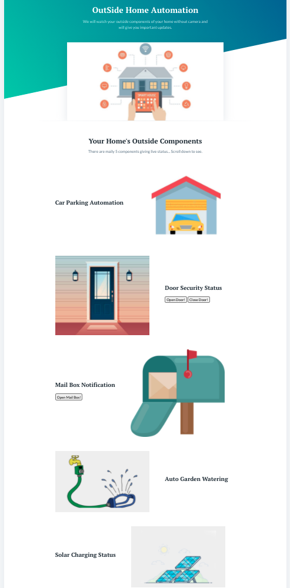
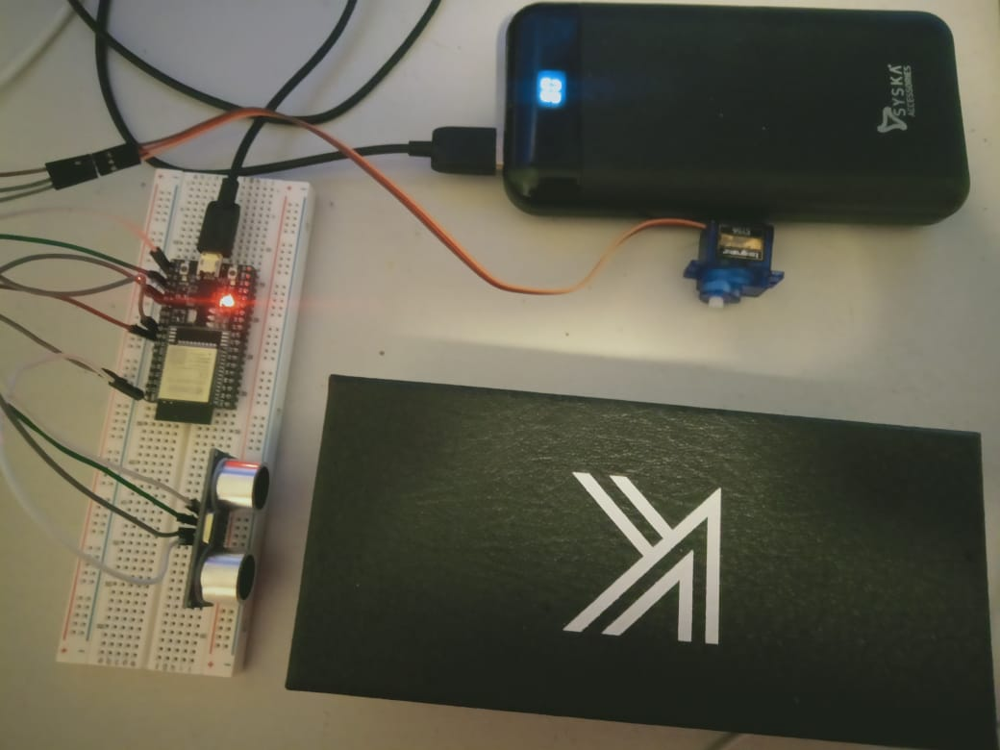

# OutSide Home Automation
Since most of home automation ideas are with respect to appliances used inside the house, we decided to automate processes outside home environment that usually require physical actions and are mundane.

Link to for the dashboard: https://outsidehomeautomation.herokuapp.com/

 

# 1. Smart Car Parking System
This is a simple code for getting the data from Ultrasonic Sensor using ESP32 and Sending the data directly to server via HTTPS request.
Here we are using ESP32 to communicate to the Heroku Server for sending the distance from the Ultrasonic sensor and show the update on the live dashboard using live website. Once car comes to the defined proper place in the parking garage the door of the garage will close automatically. 

## Sensors and Gadgets Used:
1. 2 Ultrasonic sensor
2. ESP32
4. Servo Motor

 

# 2. Model
Description

## Sensors and Gadgets Used:
1. ABC

Image\ 

# 3. Model
Description

## Sensors and Gadgets Used:
1. ABC

Image\ 

# 4. Model
Description

## Sensors and Gadgets Used:
1. ABC

Image\  

# 5. Model
Description

## Sensors and Gadgets Used:
1. ABC

Image\ 