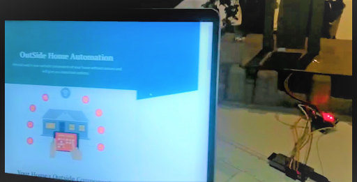

# OutSide Home Automation

Since most of home automation ideas are with respect to appliances used inside the house, we decided to automate processes outside home environment that usually require physical actions and are mundane.

Link to for the dashboard: https://outsidehomeautomation.herokuapp.com/

# 1. Smart Car Parking System

This is a simple code for getting the data from Ultrasonic Sensor using ESP32 and Sending the data directly to server via HTTPS request.
Here we are using ESP32 to communicate to the Heroku Server for sending the distance from the Ultrasonic sensor and show the update on the live dashboard using live website. Once car comes to the defined proper place in the parking garage the door of the garage will close automatically.

## Sensors and Gadgets Used:

1. 2 Ultrasonic sensor
2. ESP32
3. Servo Motor

# 2. Smart Solar Panel

We are using a ESP 32 to control to the control the angle of the panel. The server checks for the time and day and gets the amount of voltage that solar panel is gathering, then it sends the optimal position to face towards.

## Sensors and Gadgets Used:

1. ESP 32
2. Servo Motor
3. Solar Panel

## Module Architecture:

## Module Demo:

# 3. Smart Door

Owner can open or close the door from anywhere over the internet by putting the password set on the Interface. The server then send a request to the esp-32 which then commands the stepper motor to turn off or on.

## Sensors and Gadgets Used:

1. ESP 32
2. Servo Motor

## Module Architecture:

## Module Demo:

# 4. Smart postbox

Mailman is expected to press a button on the module and Esp-eye captures the image and sends it to the server and notification is sent to the owner and owner can then decide to open the mailbox or not.

## Sensors and Gadgets Used:

1. ESP32
2. ESP Eye
3. Servo motor

## Module Architecture:

## Module Demo:

# 5. Smart garden system

Implemented a example for detecting soil humidity and based on the soli status it will send the message to the server based on changing the soil condition. This code is designed in such a manner that whenever soil become dry it will send message to the server and once soil is perfectly wet then again esp32 will send the acknowledgement

## Sensors and Gadgets Used:

1. ESP 32
2. Water pump
3. Humidity sensor

## Module Architecture:

## Module Demo:

